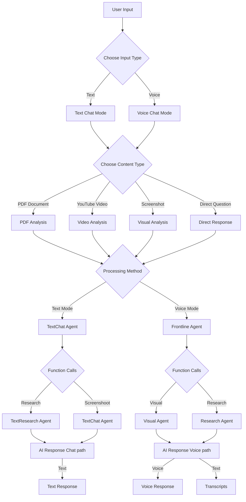
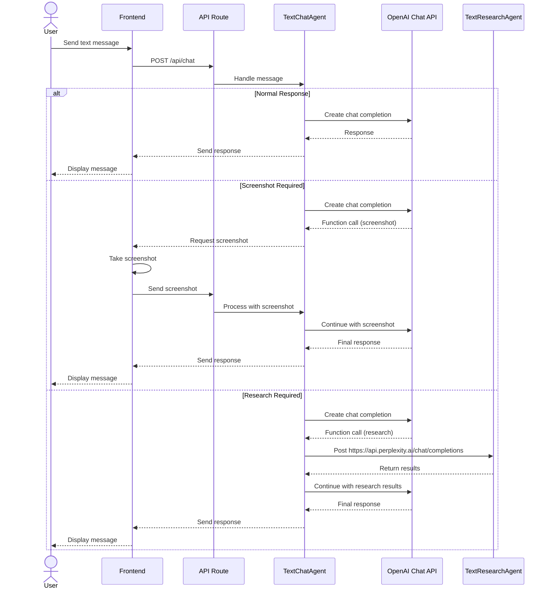
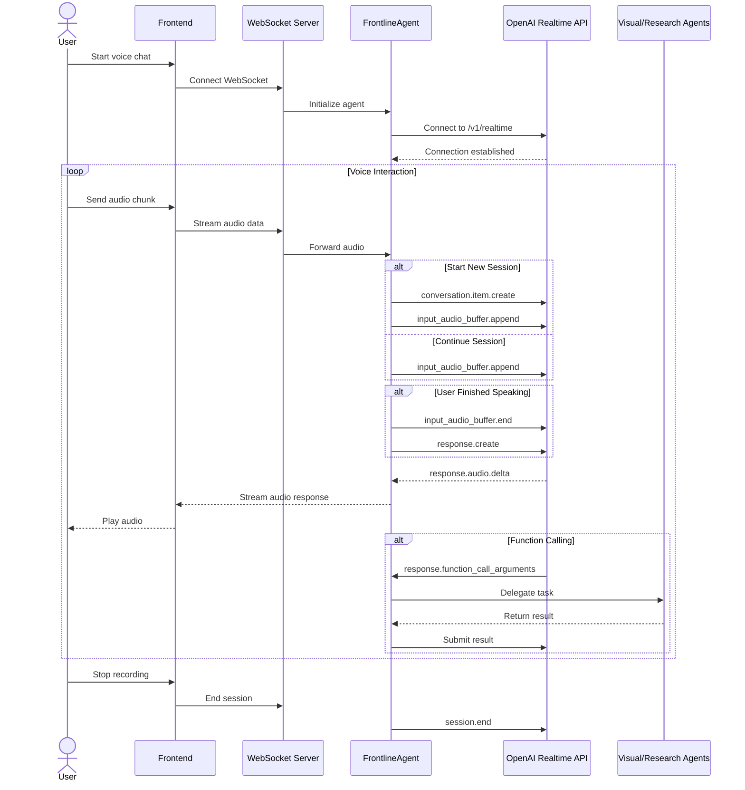

# Clarify - AI-Powered Academic Learning Assistant

Clarify is an innovative learning platform designed to help users understand complex academic content in our rapidly evolving AI-driven world. By combining real-time voice interaction, multi-agent AI systems, and a well-organized course management system, Clarify enables natural conversations about academic papers and educational videos, making advanced learning materials more accessible to everyone.

## 🎯 Key Benefits
- **Break Down Complex Topics**: Get clear explanations of difficult academic concepts
- **Interactive Learning**: Engage with content through natural voice or text conversations
- **Structured Learning Path**: Organize academic papers and videos into courses and lessons
- **Real-time Assistance**: Get immediate help while reading papers or watching videos

## 🚀 Features

- Real-time voice conversations with AI
- Text chat with markdown support  
- Visual content understanding
- Research capabilities with internet access
- Multi-modal interactions (text, voice, visual)
- Multi-agent AI system
- Course & Lesson Management
  - Create and manage courses
  - Organize content into lessons
  - Structure pdf papers and videos into courses and lessons


*Real-time Voice Chat Demo*

[](https://www.youtube.com/watch?v=SxJNaX3NuUY)

## 🛠 Tech Stack

- **Frontend**: 
  - Next.js 15, React 19
  - TailwindCSS for styling
  - WebSocket for real-time communication
  
- **Backend & Storage**: 
  - Node.js WebSocket Server for real-time interactions
  - FastAPI Python local server for video/pdf handling
  - SQLite with TypeORM for data persistence
  
- **AI Integration**:
  - OpenAI Realtime API (Beta) for voice interactions
  - OpenAI API for text processing
  - Perplexity API for research capabilities
  
- **Content Management**:
  - PDF processing and storage
  - Video file handling
  - Course and lesson organization

## 🚀 System Architecture

### Dual-Mode Interaction System
- A unified interface integrating text and voice interactions with AI



- Text chat for cost saving


- Voice chat for conviencence


### Agent System
Through Websocket
- **AgentRegistry**: Manages agent lifecycle and coordination
- **FrontlineAgent**: Handles real-time OpenAI API interactions,direct voice communication with user, and coordinates with VisualAgent and ResearchAgent
- **VisualAgent**: Processes visual queries and domain-specific tasks (work for FrontlineAgent)
- **ResearchAgent**: Performs internet searches using Perplexity API (work for FrontlineAgent)

Through POST Request
- **TextChatAgent**: Handles text chat interactions
- **TextResearchAgent**: Performs internet searches using Perplexity API (work for TextChatAgent)

### Function Calls
#### Text Chat System Functions
- **Screenshot**: Allows AI to request screenshots on the current view for further context analysis
- **Internet Research**: Uses Perplexity API to gather current information during chat

#### Voice Chat System Functions
- **Visual Analysis**: Processes visual content through screenshots, call a visual agent to analyze the result and return the answer for the user question
- **Research Integration**: Performs background research  Uses Perplexity API without interrupting voice conversation


## 🚀 Getting Started

### Prerequisites
1.For main project
- Node.js 18.18+ 
- yarn
- OpenAI API key
- Perplexity API key

2.For Local AI Server (if ou want save your course materials in your computer)
- **Python** (3.8 or higher)
   - Required for the local AI server
   - Download from [python.org](https://www.python.org/downloads/)
   - Check "Add Python to PATH" during installation

 **pip** (Python package installer)
   - Usually comes with Python installation
   - To verify, run: `python -m pip --version`
   - If not installed, follow [pip installation guide](https://pip.pypa.io/en/stable/installation/)

 **Git**
   - Required for installing the local AI server
   - Download from [git-scm.com](https://git-scm.com/downloads)

### Installation

1. Clone the repository
   ```bash
   git clone https://github.com/yourusername/clarify.git
   cd clarify
   ```

2. Install dependencies for main project
    ```bash
yarn install
   ```

3. Install dependencies for WebSocket server
   ```bash
   cd server
   yarn install
   cd ..
   ```

4. Set up environment variables
   ```bash
   cp .env.example .env
   cp server/.env.example server/.env
   ```
   
   Add the following to both `.env` files:
   ```env
   # Root .env
   OPENAI_API_KEY=your_key_here
   JWT_SECRET=your_secret_here
   PERPLEXITY_API_KEY=your_perplexity_key_here
   NEXT_PUBLIC_WS_URL=ws://localhost:3001

   # server/.env
   OPENAI_API_KEY=your_key_here
   WS_PORT=3001
   ```

5. Set up and Run local AI server and Run it

```bash
yarn start_local_server
```
If this doesn't work, you can try to clone the repo and run the local-ai-server manually.

### Development
Run the development server:
```bash
yarn dev
```

This starts:
- Next.js on [http://localhost:3000](http://localhost:3000)
- WebSocket server on port 3001 (automatically through concurrently)

### Production

Build and start the production server:
```bash
yarn build
yarn start
```

## 🚀 Project Structure
```
clarify/
├── app/                        # Next.js app router
│   ├── api/                    # API routes
│   ├── auth/                   # Authentication pages
│   ├── components/             # Components for internal pages
│   ├── courses/                # Courses and lessons pages
│   ├── dashboard/              # Dashboard page
│   └── profile/                # Profile page
├── components/
│   ├── layout/                 # Layout components
│   └── ui/                     # Shadcn ui components
├── server/
│   ├── AgentRegistry.ts        # Agent registry
│   └── websocket.ts            # WebSocket server implementation
├── agents/
│   ├── BaseAgent.ts            # Base agent class
│   ├── FrontlineAgent.ts       # Primary user interaction voice agent
│   ├── VisualAgent.ts          # Agent for visual inputs (for FrontlineAgent)
│   ├── ResearchAgent.ts        # Agent for internet information (for FrontlineAgent)
│   ├── TextChatAgent.ts        # Agent for text chat
│   └── TextResearchAgent.ts    # Agent for internet information (for TextChatAgent)
├── tools/                      # Tools used for function calling
├── hooks/                      # React hooks
├── lib/                        # Shared utilities
├── entities/                   # SQLite database entities
├── types/                      # TypeScript types
└── public/                     # Static assets
```

## 🚀 Contributing

1. Fork the repository
2. Create your feature branch (`git checkout -b feature/AmazingFeature`)
3. Commit your changes (`git commit -m 'feat: add some amazing feature'`)
4. Push to the branch (`git push origin feature/AmazingFeature`)
5. Open a Pull Request

## 🚀 License
This project is licensed under the MIT License - see the [licenses/LICENSE](licenses/LICENSE) file for details.

For information about third-party licenses, please see: [THIRD-PARTY.md](licenses/THIRD-PARTY.md) - Complete third-party license information
- [LICENSE_APACHE](licenses/LICENSE_APACHE) - Apache-2.0 licensed components
- [LICENSE_BSD](licenses/LICENSE_BSD) - BSD-3-Clause licensed components